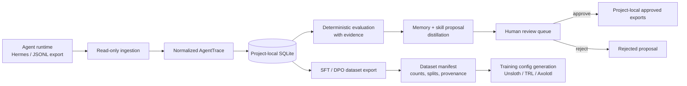
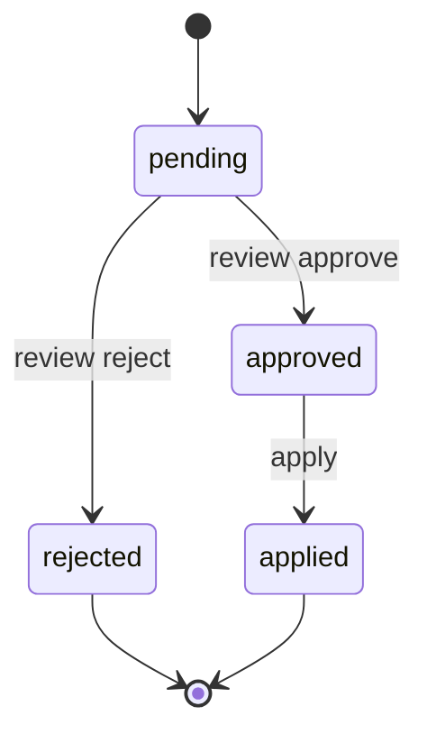

# SkillLoop

SkillLoop is a local-first learning governor for AI agent runtimes.

It sits beside an agent runtime, reads completed execution traces, evaluates what happened, proposes durable learning artifacts, and exports reviewed datasets for later model improvement. It does not replace the runtime and it does not silently mutate global agent state.

Current primary integration: Hermes Agent via read-only ingestion from `~/.hermes/state.db`.

> Status: proof-of-work / early local sidecar. The project now has the core trace -> evaluation -> proposal -> review -> export pipeline, plus Hermes setup/status/controller UX. It is not yet a fully unattended production daemon and it does not run training.

## Why SkillLoop exists

Agents already execute work. The missing layer is governed learning:

- What did the agent do?
- Was the result actually supported by evidence?
- What should be remembered?
- Which workflows are reusable?
- Which traces are safe and useful for training data?
- What needs human approval before becoming permanent?

SkillLoop keeps this loop explicit, reviewable, and project-local.



## Current capabilities

### Trace ingestion

SkillLoop can ingest:

- generic JSONL message traces
- Hermes-style JSON exports
- Hermes `state.db` sessions through a read-only SQLite connection
- incremental Hermes DB sessions through controller policy (`max_sessions`, unseen-session filtering)

All traces are normalized into a stable `AgentTrace` schema with:

- schema version
- runtime metadata
- adapter metadata
- message list
- span-ready tool call metadata
- raw artifact reference
- raw and normalized content hashes

### Evaluation

The evaluator is deterministic and local. It scores traces using observable signals such as:

- final answer presence
- tool failures and error signals
- success indicators
- user correction signals
- structured evidence summaries

Evaluations carry evaluator name/version, trace schema version, source hashes, evidence, and tags.

### Distillation and proposal lifecycle

SkillLoop currently creates memory and skill proposals from traces. It does not directly write memories or skills into Hermes.

Proposal lifecycle:



Approved proposals are exported locally under `.skillloop/approved/`.

### Dataset export

SkillLoop exports:

- SFT JSONL records: `{ "messages": [...] }`
- DPO JSONL records: `{ "prompt": ..., "chosen": ..., "rejected": ... }`

DPO export is conservative: it only exports explicit chosen/rejected pairs already present in trace metadata.

Dataset export supports:

- score gates
- deterministic train/validation/test splits
- manifests
- source trace IDs
- evaluation/proposal provenance summaries
- estimated token counts

### Training config generation

SkillLoop can generate reviewed training configuration artifacts for:

- TRL
- Unsloth
- Axolotl

It does not run training. Generated configs carry explicit `auto_run=false`-style safety metadata.

### Controller and setup UX

The controller turns the manual pipeline into one governed tick:

```text
ingest -> evaluate -> distill -> optional dataset export -> report
```

Available controller UX:

- `skillloop setup --connect hermes --start`
- `skillloop status`
- `skillloop controller run`
- `skillloop controller history`
- `skillloop controller show <run-id-or-prefix>`
- `skillloop service install/status/uninstall` for launchd-backed recurring controller ticks on macOS

Controller run reports are stored in SQLite and mirrored as JSON under `.skillloop/controller_runs/`.

Background service installation currently writes project-specific launchd plists and records `.skillloop/service.json`; it prints the exact `launchctl` commands rather than silently starting OS services.

## What SkillLoop intentionally does not do yet

- It does not replace Hermes or any other runtime.
- It does not write into `~/.hermes/memories`, `~/.hermes/skills`, or global agent config.
- It does not auto-apply proposals.
- It does not auto-promote prompts, models, or skills.
- It does not run fine-tuning.
- It does not store credentials.
- It does not require cloud services.

## Install for local development

SkillLoop requires Python 3.11+.

```bash
git clone <repo-url>
cd skillloop
python -m pip install -e '.[dev]'
```

After installation, use either:

```bash
python -m skillloop.cli --path . <command>
```

or:

```bash
skillloop --path . <command>
```

## Quickstart: local sample trace

```bash
skillloop --path . init
skillloop --path . ingest generic examples/traces/simple_trace.jsonl
skillloop --path . traces list
skillloop --path . eval latest --evaluator rubric
skillloop --path . distill latest
skillloop --path . review list --verbose
skillloop --path . export sft --out data/sft.jsonl --min-score 70 --splits train=0.8,validation=0.1,test=0.1
skillloop --path . benchmark --out data/benchmark.json
```

To test review/apply:

```bash
skillloop --path . review approve <proposal-id-or-prefix>
skillloop --path . apply
```

Approved artifacts are written to:

```text
.skillloop/approved/memory/*.md
.skillloop/approved/skill/*.md
```

## Quickstart: Hermes sidecar setup

```bash
skillloop --path . setup --connect hermes --start
skillloop --path . status
skillloop --path . controller history
skillloop --path . controller show <run-id-or-prefix>
skillloop --path . service install --kind launchd --interval-seconds 3600
skillloop --path . service status
```

This creates `.skillloop/policy.json` with read-only Hermes DB ingestion and runs one controller tick when `--start` is provided.

Useful options:

```bash
skillloop --path . setup --connect hermes \
  --db-path ~/.hermes/state.db \
  --max-sessions 20 \
  --min-score 70 \
  --auto-export \
  --dataset-out data/sft.jsonl \
  --start
```

`--auto-export` enables controller-managed SFT export (`dataset.auto_update: true`), still bounded by the configured evaluation condition and score gate.

## CLI overview

```text
skillloop --path <project-root> init
skillloop --path <project-root> setup --connect hermes [--start] [--auto-export]
skillloop --path <project-root> status [--json]

skillloop --path <project-root> ingest generic <jsonl-path>
skillloop --path <project-root> ingest hermes <json-path>
skillloop --path <project-root> ingest hermes-db --latest [--db-path ~/.hermes/state.db]
skillloop --path <project-root> ingest hermes-db --session-id <id> [--db-path ~/.hermes/state.db]

skillloop --path <project-root> traces list
skillloop --path <project-root> traces show <trace-id|latest>

skillloop --path <project-root> eval <trace-id|latest> [--evaluator rubric]
skillloop --path <project-root> distill <trace-id|latest>

skillloop --path <project-root> review list [--verbose] [--all]
skillloop --path <project-root> review approve <proposal-id-prefix>
skillloop --path <project-root> review reject <proposal-id-prefix>
skillloop --path <project-root> apply

skillloop --path <project-root> export sft --out <path> [--min-score N] [--splits train=0.8,validation=0.1,test=0.1]
skillloop --path <project-root> export dpo --out <path> [--min-score N]

skillloop --path <project-root> benchmark [--baseline rubric_legacy] [--candidates rubric] [--out benchmark.json]
skillloop --path <project-root> training-config trl|unsloth|axolotl --dataset-manifest <manifest> --base-model <model> --output-dir <dir> --config-dir <dir>

skillloop --path <project-root> loop run [--condition JSON] [--require-tag TAG] [--forbid-tag TAG]
skillloop --path <project-root> loop schedule [--interval hourly|daily|weekly]
skillloop --path <project-root> loop status
skillloop --path <project-root> loop tick [--force]

skillloop --path <project-root> controller run
skillloop --path <project-root> controller history [--limit N]
skillloop --path <project-root> controller show <run-id-or-prefix>
```

See `docs/cli.md` for the full command reference.

## Repository layout

```text
skillloop/
  adapters/          Trace ingestion adapters
  apply/             Review-approved filesystem exports
  distill/           Memory and skill proposal generation
  eval/              Deterministic evaluators, registry, structured evidence
  export/            SFT and DPO dataset exporters
  review/            Proposal review queue helpers
  conditions.py      Declarative done/stopped/failing conditions
  controller.py      Policy-driven ingest/eval/distill/export tick
  dataset.py         Dataset split, manifest, provenance, and stats helpers
  loop.py            Outer-loop scheduling primitives
  policy.py          Conservative controller policy schema
  provenance.py      Component provenance and source hashing
  schema.py          Normalized trace/evaluation/proposal dataclasses
  store.py           SQLite persistence layer
  training_config.py Training config generation only
examples/
  traces/            Sample input traces
docs/                Architecture, CLI, safety, and schema documentation
references/          Reference Hermes skills and analysis artifacts
tests/               Pytest coverage
```

## Safety and governance model

SkillLoop is intentionally conservative:

- local-first state under `.skillloop/`
- read-only integration with Hermes `state.db`
- no credential storage
- common secret redaction during ingestion/export
- proposal review before apply
- project-local approved exports only
- dataset manifests with provenance
- generated training configs only; no training runner
- no global Hermes mutation in v1

See `docs/safety.md` for details.

## Current roadmap

### P0 complete / current base

- core trace ingestion and normalized schema
- local SQLite store
- deterministic evaluator and evidence records
- memory/skill proposals
- review/apply lifecycle
- dataset exports and manifests
- replay benchmark reports
- training config generation
- Hermes setup/status/controller run UX
- persisted controller run history

### Next product steps

1. Add a real background service runner (`launchd` first, then Linux systemd/cron).
2. Add dataset readiness judging before any training plan or training runner.
3. Add evaluator staleness detection when evaluator component hashes change.
4. Add stronger evidence-trust scoring so exports learn from verified work, not claims.
5. Add training planner artifacts, still approval-gated and no auto-run.

## Development checks

```bash
python -m pytest -q
python -m compileall skillloop tests -q
git diff --check
python -m pip wheel . --no-deps -w /tmp/skillloop-wheel-check
```

## Documentation

- `docs/architecture.md` — system architecture and module responsibilities
- `docs/cli.md` — command reference and smoke test
- `docs/safety.md` — safety boundaries and threat model
- `docs/trace-schema.md` — normalized trace/evaluation/proposal/export schema
- `docs/analysis/loop-engineering-analysis.md` — loop-engineering analysis and Hermes skill references

## License

Proprietary. All rights reserved.

No permission is granted to use, copy, modify, distribute, sublicense, host, train on, or create derivative works from this repository or its contents without prior written permission from the copyright holder. See `LICENSE`.
