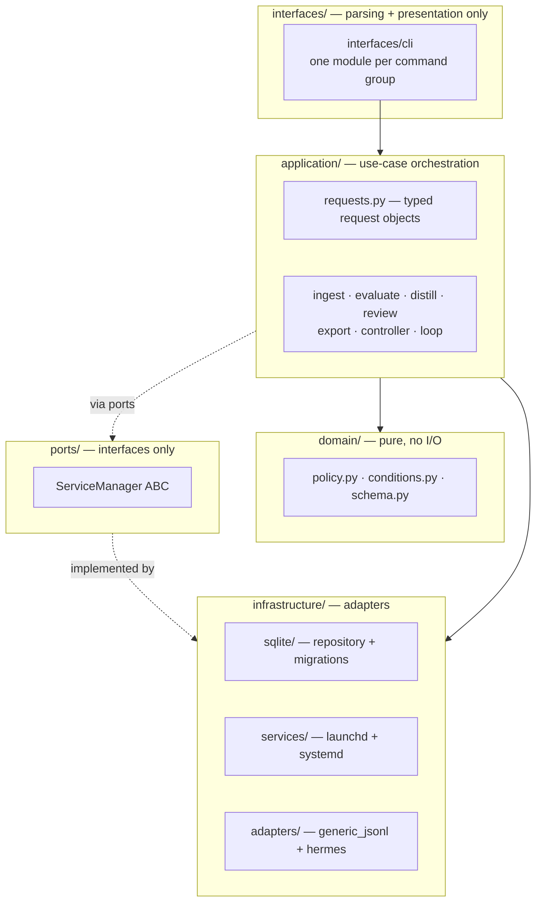

<p align="center">
  <h1 align="center">SkillLoop</h1>
  <p align="center">A governed learning layer for AI agents.</p>
  <p align="center">
    Turn agent execution traces into reviewed memories, reusable skills, and evidence-backed training data — without silently mutating your agent's global state.
  </p>
</p>

<p align="center">
  <a href="https://github.com/lamenting-hawthorn/skillloop/actions/workflows/ci.yml"></a>
  <a href="https://github.com/lamenting-hawthorn/skillloop/releases"></a>
  <a href="LICENSE"></a>
  <a href="https://www.python.org/downloads/"></a>
  <a href="docs/compatibility.md"></a>
  <a href="https://github.com/lamenting-hawthorn/skillloop/issues"></a>
</p>

---

SkillLoop sits in the gap between "an agent did work" and "the system should safely learn from that work." Most agent systems can execute tasks. Fewer can answer:

- What actually happened?
- Was the outcome supported by evidence?
- Which lessons are durable enough to remember?
- Which workflows should become reusable skills?
- Which traces are safe enough to become training data?
- What must stay behind human approval?

SkillLoop makes that loop explicit, local, and review-gated.

It runs as a **local sidecar** beside an agent runtime, ingests completed traces, normalizes them, evaluates them, proposes learning artifacts, gates those artifacts through human review, and prepares datasets/configs for future model improvement — without ever auto-mutating global memory, skills, prompts, or model state.

The first runtime integration is **Hermes Agent** via read-only ingestion from `~/.hermes/state.db`. The architecture is runtime-agnostic: Hermes is the first adapter, not the only possible runtime.

> **Status:** early local sidecar. The core `trace → evaluation → proposal → review → export` pipeline is implemented end-to-end, with 145 passing tests. SkillLoop is not yet an unattended production daemon and does not run training.

---

## Table of contents

- [Why this project matters](#why-this-project-matters)
- [How it works](#how-it-works)
- [Features](#features)
- [Install](#install)
- [Quickstart](#quickstart)
- [Use as a Hermes sidecar](#use-as-a-hermes-sidecar)
- [CLI reference](#cli-reference)
- [Configuration](#configuration)
- [Architecture](#architecture)
- [Safety model](#safety-model)
- [Repository layout](#repository-layout)
- [Development](#development)
- [Testing](#testing)
- [Contributing](#contributing)
- [Roadmap](#roadmap)
- [Known limitations](#known-limitations)
- [Documentation](#documentation)
- [License](#license)

## Why this project matters

Agents are accumulating operational experience: tool calls, failures, corrections, successful workflows, user preferences, project conventions, and domain-specific procedures. The hard part is not storing more context — it is deciding what should become **durable system knowledge**.

SkillLoop treats learning as a governed pipeline:

```text
runtime traces
  → normalized trace records
  → deterministic evaluation
  → evidence extraction
  → memory / skill proposals
  → human review
  → approved local exports
  → dataset and training-config preparation
```

This gives an agent system a safer path from experience to improvement.

## How it works

SkillLoop separates three responsibilities that are often blended together:

```text
Agent runtime   = executes work and records sessions
SkillLoop       = evaluates traces and governs learning
Memory / models = durable downstream systems updated only through policy gates
```


SkillLoop stores local governor state in `.skillloop/`. It can read Hermes sessions, but it **never** writes into Hermes memory, skills, config, cron jobs, tools, or model state. That boundary is the product.

## Features

- **Runtime-agnostic trace ingestion** — generic JSONL, Hermes JSON export, and read-only Hermes `state.db` (with incremental unseen-session filtering). All inputs normalize to a stable `AgentTrace` schema with message history, tool-call metadata, content hashes, and provenance.
- **Deterministic evaluation** — local, heuristic scoring (final-answer presence, tool failures, success indicators, user corrections, structured evidence) with evaluator name/version, evidence, tags, and provenance. LLM judges are intentionally deferred until cost tracking and budget policy exist.
- **Review-gated proposals** — distills traces into memory and skill proposals that flow through an explicit pending → approved/rejected → applied state machine. Nothing is auto-applied.
- **Dataset export** — SFT and DPO JSONL with score gates, deterministic train/val/test splits, manifests, source-trace IDs, evaluation/proposal provenance, and token estimates. OKF bundle export packages approved proposals as a portable, git-diffable [Open Knowledge Format](https://github.com/GoogleCloudPlatform/knowledge-catalog/blob/main/okf/SPEC.md) bundle.
- **Training config generation** — TRL, Unsloth, and Axolotl configs with explicit no-auto-run safety metadata. SkillLoop never runs training.
- **Controller & service UX** — one-shot controller ticks, run history, and cross-platform service install (macOS launchd + Linux systemd) with explicit activation only.
- **Health checks** — `skillloop doctor` verifies version, Python, project permissions, SQLite integrity, policy parsing, dataset path safety, and connector availability.
- **Safety by default** — atomic writes, conservative file permissions, secret + PII redaction, policy/adapter validation, symlink guards, and an error taxonomy (`ConfigError` / `InputError` / `PersistenceError` / `ConnectorError` / `PolicyError`).

## Install

SkillLoop requires **Python 3.11+** and has **zero runtime dependencies**.

### pipx (recommended for users)

```bash
pipx install git+https://github.com/lamenting-hawthorn/skillloop.git
skillloop --version          # 0.2.0
skillloop doctor             # health check
```

Pin to a release tag for production:

```bash
pipx install git+https://github.com/lamenting-hawthorn/skillloop.git@v0.2.0
```

### uv tool

```bash
uv tool install git+https://github.com/lamenting-hawthorn/skillloop.git
```

### Virtual environment

```bash
python -m venv .venv && source .venv/bin/activate
pip install git+https://github.com/lamenting-hawthorn/skillloop.git
```

### Editable (contributors)

```bash
git clone https://github.com/lamenting-hawthorn/skillloop.git
cd skillloop
pip install -e '.[dev]'
```

See [docs/compatibility.md](docs/compatibility.md) for the full platform/Python/OS support matrix and [docs/migration.md](docs/migration.md) for upgrade notes (including the automatic v1→v2 SQLite migration).

## Quickstart

```bash
# 1. Install
pipx install git+https://github.com/lamenting-hawthorn/skillloop.git

# 2. Initialize a project and verify your environment
skillloop --path . init
skillloop --path . doctor

# 3. Ingest a sample trace
skillloop --path . ingest generic examples/traces/simple_trace.jsonl
skillloop --path . traces list

# 4. Evaluate, distill, and review
skillloop --path . eval latest --evaluator rubric
skillloop --path . distill latest
skillloop --path . review list --verbose

# 5. Approve a proposal and export a dataset
skillloop --path . review approve <proposal-id-prefix>
skillloop --path . apply
skillloop --path . export sft --out data/sft.jsonl --min-score 70 \
  --splits train=0.8,validation=0.1,test=0.1

# 6. Benchmark evaluator versions (optional)
skillloop --path . benchmark --out data/benchmark.json
```

Both `skillloop ...` and `python -m skillloop ...` work as entry points.

## Use as a Hermes sidecar

```bash
# One-shot setup + controller tick + optional dataset export
skillloop --path . setup --connect hermes --start --auto-export

# Inspect state
skillloop --path . status
skillloop --path . controller history
skillloop --path . controller show <run-id-or-prefix>
```

Useful setup options:

```bash
skillloop --path . setup --connect hermes \
  --db-path ~/.hermes/state.db \
  --max-sessions 20 \
  --min-score 70 \
  --auto-export \
  --dataset-out data/sft.jsonl \
  --start
```

### Recurring controller ticks

**macOS (launchd):**

```bash
skillloop --path . service install --kind launchd --interval-seconds 3600
skillloop --path . service status
skillloop --path . service uninstall
```

**Linux (systemd user-service):**

```bash
skillloop --path . service install --kind systemd --interval-seconds 3600
skillloop --path . service status
skillloop --path . service uninstall
```

SkillLoop writes the service file and `.skillloop/service.json` metadata, then prints the exact OS command to load/unload it. **It never silently starts an OS service.** Activation is always explicit.

## CLI reference

```text
skillloop --path <project> init                              Initialize project state
skillloop --path <project> doctor [--json]                   Health check
skillloop --path <project> setup --connect hermes [--start]  Configure + optional tick
skillloop --path <project> status [--json]                   Project status

# Traces
skillloop --path <project> ingest generic <jsonl>
skillloop --path <project> ingest hermes <json> | hermes-db --latest | hermes-db --session-id <id>
skillloop --path <project> traces list
skillloop --path <project> traces show <id|latest>

# Evaluation & distillation
skillloop --path <project> eval <id|latest> [--evaluator rubric]
skillloop --path <project> distill <id|latest>

# Review & apply
skillloop --path <project> review list [--verbose] [--all]
skillloop --path <project> review approve|reject <proposal-id-prefix>
skillloop --path <project> apply

# Export
skillloop --path <project> export sft --out <path> [--min-score N] [--splits ...]
skillloop --path <project> export dpo --out <path>
skillloop --path <project> export okf --out <path>

# Benchmark & training config
skillloop --path <project> benchmark [--baseline rubric_legacy] [--candidates rubric] [--out file]
skillloop --path <project> training-config trl|unsloth|axolotl ...

# Outer loop
skillloop --path <project> loop run|schedule|status|tick [...]

# Controller
skillloop --path <project> controller run|history|show <id>

# Service
skillloop --path <project> service install|status|uninstall --kind launchd|systemd
```

See [docs/cli.md](docs/cli.md) for the full command reference.

## Configuration

SkillLoop stores project-local configuration under `.skillloop/`:

```text
.skillloop/
  skillloop.db            SQLite (schema v2) — traces, evaluations, proposals, controller runs
  policy.json             Controller policy (ingestion, evaluation, dataset, training safety)
  approved/               Approved exports (memory/*.md, skill/*.md)
  controller_runs/       Controller run reports (JSON, mirrored from SQLite)
  service.json            Service install metadata
```

The controller policy (`policy.json`) is written by `setup` and validated on load: unknown adapters, invalid evaluators, and out-of-range scores are rejected with a `PolicyError`. Policy saves are atomic (temp-file + rename) with conservative permissions (files `0o600`, dirs `0o700`).

## Architecture

SkillLoop is a **layered modular-monolith**. Dependencies flow downward only; domain code is pure and never imports infrastructure.



**Layer rules:**

- **Domain** (`policy`, `conditions`, `schema`) never imports `sqlite3`, `argparse`, `launchd`, `subprocess`, or Hermes — pure logic and dataclasses.
- **Application** services coordinate use cases but own no infrastructure details. CLI modules translate `argparse.Namespace` into typed request objects and render output.
- **Ports** define infrastructure interfaces (`ServiceManager`) with no I/O.
- **Infrastructure** adapters implement the ports: `sqlite/` (repository + versioned migration registry), `services/` (launchd + systemd), `adapters/` (trace ingestion).
- Backward-compatible shims (`store.py`, `cli.py`, `service.py`) re-export new locations so existing imports keep working until a major release.

The controller turns the manual pipeline into one governed, atomic local tick:

```text
ingest → evaluate → distill → (optional dataset export) → report
```

Controller runs are wrapped in an explicit transaction boundary, with sanitized error reports (trace content and credentials cannot leak). Reports are stored in SQLite and mirrored as JSON under `.skillloop/controller_runs/`.

## Safety model

SkillLoop is intentionally conservative.

**It does:**

- keep all state local under `.skillloop/`
- read Hermes `state.db` without mutating it
- redact common secret patterns (and optional PII) during ingestion/export
- require review before any artifact is applied
- generate dataset manifests with full provenance
- generate training configs without running training
- write atomically (temp-file + rename) with conservative permissions

**It does not:**

- replace Hermes or any other runtime
- write into `~/.hermes/memories`, `~/.hermes/skills`, or global config
- auto-apply memory, skill, prompt, or model changes
- auto-promote trained models
- run fine-tuning
- store credentials
- require cloud services

This keeps SkillLoop useful as a local learning governor without turning it into an uncontrolled mutation layer. See [docs/safety.md](docs/safety.md) for the full threat model.

## Repository layout

```text
skillloop/
  interfaces/cli/      argparse parsing + presentation (one module per command group)
  application/         use-case orchestration + typed request objects (requests.py)
  ports/               infrastructure interfaces (ServiceManager ABC)
  infrastructure/
    sqlite/            repository.py + migrations.py (versioned migration registry)
    services/          launchd.py + systemd.py (ServiceManager implementations)
  adapters/            trace ingestion (generic_jsonl, hermes)
  domain/              (conceptual) policy.py, conditions.py, schema.py — pure, no I/O
  eval/                deterministic evaluators, registry, structured evidence
  distill/             memory & skill proposal generation
  review/              proposal review queue helpers
  export/              SFT, DPO, OKF dataset exporters
  apply/               review-approved filesystem exports
  diagnostics.py       skillloop doctor health checks
  errors.py            error taxonomy (Config/Input/Persistence/Connector/Policy)
  fs_safety.py         atomic writes, conservative permissions, symlink guards
  sanitize.py          secret + PII redaction
  store.py             backward-compat shim → infrastructure/sqlite
  cli.py               backward-compat re-export → interfaces/cli
  service.py           backward-compat facade → infrastructure/services
  py.typed             PEP 561 marker
examples/              sample input traces
docs/                  architecture, CLI, safety, schema, compatibility, migration
tests/                 145 tests (unit + E2E + backward-compat)
.github/               issue/PR templates, SECURITY, SUPPORTED_VERSIONS, CI, release
```

## Development

```bash
git clone https://github.com/lamenting-hawthorn/skillloop.git
cd skillloop
pip install -e '.[dev]'
```

### Development checks

```bash
python -m pytest -q                              # 145 tests
python -m ruff check .                            # lint (0 errors)
python -m ruff format --check .                   # format check
python -m mypy skillloop/errors.py skillloop/conditions.py \
               skillloop/policy.py skillloop/schema.py \
               skillloop/ports/service_manager.py # typed boundaries
python -m compileall skillloop tests -q           # compile check
git diff --check                                  # whitespace check
python -m build --wheel                           # wheel build
```

### CI

CI runs on push to `main` and on PRs across **Python 3.11, 3.12, and 3.13**:

- lint (ruff)
- mypy (typed boundaries)
- tests + coverage
- compile check
- wheel build + isolated clean-install smoke test
- full CLI smoke pipeline (init → ingest → eval → distill → review → export)

Tagged releases (`v*`) trigger an automated release workflow that builds wheel + sdist, generates SHA256 checksums, and creates a GitHub Release with provenance.

## Testing

```bash
python -m pytest -q                  # all tests
python -m pytest tests/test_e2e.py   # full pipeline E2E
python -m pytest tests/test_backward_compat_schema.py   # v1→v2 schema
python -m pytest tests/test_cli_backward_compat.py      # CLI syntax
```

Tests cover unit behavior, the full E2E pipeline (init → ingest → eval → distill → review → apply → export), backward-compatible CLI syntax, and the SQLite v1→v2 migration.

## Contributing

Contributions are welcome! Please read [CONTRIBUTING.md](CONTRIBUTING.md) for guidelines.

- **Bugs & feature requests:** open an [issue](https://github.com/lamenting-hawthorn/skillloop/issues/new/choose) using the provided templates.
- **Security reports:** see [SECURITY.md](.github/SECURITY.md) — report vulnerabilities privately, do not open public issues.
- **Supported versions:** see [.github/SUPPORTED_VERSIONS.md](.github/SUPPORTED_VERSIONS.md).
- **Pull requests:** use the PR template; ensure tests pass, ruff is clean, and the changelog is updated.

## Roadmap

SkillLoop is not trying to become a second agent runtime. The next work makes the learning layer more useful, safer, and more evidence-grounded.

1. **Core learning-loop quality** — better memory/skill proposal quality, stronger evidence links, clearer trust reasons.
2. **Clean demo & deployment path** — one- or two-command proof of the full sidecar flow.
3. **Review/Apply UX polish** — the review gate is the safety boundary; make it easy to inspect, compare, and apply.
4. **Typed-memory connector** — bridge to a canonical typed-memory backend (semantic/episodic/procedural), read-only first.
5. **Evaluator staleness & evidence trust** — detect evaluator changes, separate verified evidence from assistant claims.
6. **Training planner** — reviewable plans after readiness/staleness/evidence gates; training remains manual/approved.

### Shipped in 0.2.0

- Linux systemd user-service generation (behind the `ServiceManager` port)
- SQLite schema v2 with a versioned, atomic, idempotent migration registry
- Indexes on evaluations, proposals, and controller history
- Bulk latest-evaluation queries (no per-trace N+1)
- SQLite busy timeout for concurrent local processes
- Atomic JSON/config writes + conservative file permissions
- Error taxonomy + PII redaction + policy/adapter validation
- Ruff + mypy (typed boundaries) + coverage CI across Python 3.11–3.13
- E2E + backward-compatibility test coverage
- `skillloop doctor` pre-flight health check

## Known limitations

- The current evaluator is deterministic and heuristic-based (LLM judges are deferred).
- Distillation is useful but still basic.
- DPO export requires explicit chosen/rejected pairs in trace metadata.
- No typed-memory connector yet.
- No dataset readiness judge yet.
- Redaction is a safety net, not a complete DLP system.
- Training configs can be generated, but training does not run automatically.

These are design constraints, not hidden claims.

## Documentation

| Document | Description |
|----------|-------------|
| [docs/architecture.md](docs/architecture.md) | System architecture and module responsibilities |
| [docs/cli.md](docs/cli.md) | Full command reference |
| [docs/safety.md](docs/safety.md) | Safety boundaries and threat model |
| [docs/trace-schema.md](docs/trace-schema.md) | Normalized trace/evaluation/proposal/export schema |
| [docs/compatibility.md](docs/compatibility.md) | Platform/Python/OS support matrix |
| [docs/migration.md](docs/migration.md) | Upgrade notes (v1→v2 SQLite migration) |
| [CHANGELOG.md](CHANGELOG.md) | Release history |

## License

Apache License 2.0. See [LICENSE](LICENSE).
