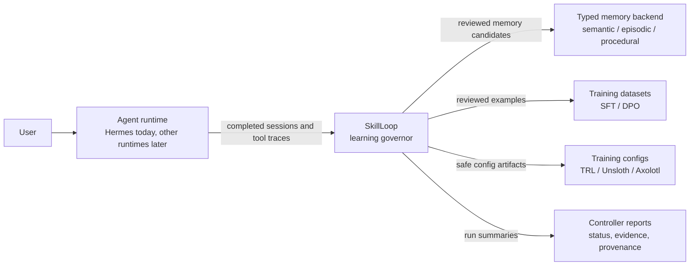
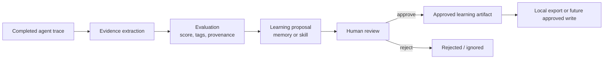
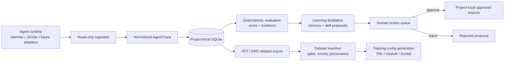
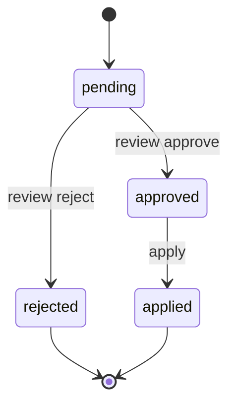

# SkillLoop

**A governed learning layer for AI agents.**

SkillLoop turns agent execution traces into reviewed memories, reusable workflows,
training datasets, and evidence-backed improvement signals. It is built for the
gap between "an agent did work" and "the system should safely learn from that
work."

Most agent systems can execute tasks. Fewer can answer:

- What actually happened?
- Was the outcome supported by evidence?
- Which lessons are durable enough to remember?
- Which workflows should become reusable skills?
- Which traces are safe enough to become training data?
- What must stay behind human approval?

SkillLoop makes that loop explicit.

It runs as a local sidecar beside an agent runtime, ingests completed traces,
normalizes them, evaluates them, proposes learning artifacts, gates those
artifacts through review, and prepares datasets/configs for future model
improvement.

Current first-class integration: **Hermes Agent** through read-only ingestion
from `~/.hermes/state.db`.

The architecture is runtime-agnostic: Hermes is the first adapter, not the only
possible runtime.

> **Status:** early local sidecar / proof-of-work. The core
> `trace -> evaluation -> proposal -> review -> export` pipeline is implemented,
> with Hermes setup/status/controller UX, controller run history, dataset export,
> training config generation, and macOS launchd plist generation. SkillLoop is
> not yet a fully unattended production daemon and does not run training.

## Why This Project Matters

Agents are starting to accumulate operational experience: tool calls, failures,
corrections, successful workflows, user preferences, project conventions, and
domain-specific procedures.

The hard part is not simply storing more context. The hard part is deciding what
should become durable system knowledge.

SkillLoop treats learning as a governed pipeline:

```text
runtime traces
  -> normalized trace records
  -> deterministic evaluation
  -> evidence extraction
  -> memory / skill proposals
  -> human review
  -> approved local exports
  -> dataset and training-config preparation
```

This gives an agent system a safer path from experience to improvement without
silently mutating global memory, skills, prompts, or model state.

## Core Idea

SkillLoop separates three responsibilities that are often blended together:

```text
Agent runtime   = executes work and records sessions
SkillLoop       = evaluates traces and governs learning
Memory / models = durable downstream systems updated only through policy gates
```



In the current implementation, SkillLoop stores local governor state in
`.skillloop/`. It can read Hermes sessions, but it does not write into Hermes
memory, skills, config, cron jobs, tools, or model state.

That boundary is the product.

## Architecture

The central lifecycle is deliberately review-gated:





The controller turns the manual pipeline into one governed local tick:

```text
ingest -> evaluate -> distill -> optional dataset export -> report
```

Controller reports are stored in SQLite and mirrored as JSON under
`.skillloop/controller_runs/`.

## What Works Today

### Runtime Trace Ingestion

SkillLoop can ingest:

- generic JSONL message traces
- Hermes-style JSON exports
- Hermes `state.db` sessions through read-only SQLite access
- incremental Hermes DB sessions using unseen-session filtering

All inputs are normalized into a stable `AgentTrace` schema with:

- runtime and adapter metadata
- message history
- span-ready tool call metadata
- raw artifact references
- raw and normalized content hashes
- schema versioning

### Deterministic Evaluation

The current evaluator is local and deterministic. It scores traces using
observable signals such as:

- final answer presence
- tool failures and error signals
- success indicators
- user correction signals
- structured evidence summaries

Evaluations carry evaluator name/version, trace schema version, source hashes,
evidence, tags, and provenance.

This is intentionally not an LLM judge yet. LLM-based evaluation should wait
until cost tracking, evidence trust, and budget policy exist.

### Proposal Distillation

SkillLoop distills traces into candidate learning artifacts:

- memory proposals for durable facts, preferences, corrections, and conventions
- skill proposals for reusable workflows and procedures

Distillation does not directly mutate runtime memory or skills. It writes
reviewable proposals.



Approved artifacts are currently exported locally under:

```text
.skillloop/approved/memory/*.md
.skillloop/approved/skill/*.md
```

### Dataset Export

SkillLoop can export reviewed training-data candidates:

- SFT JSONL records: `{ "messages": [...] }`
- DPO JSONL records: `{ "prompt": ..., "chosen": ..., "rejected": ... }`

DPO export is conservative: it only exports explicit chosen/rejected pairs that
already exist in trace metadata.

Dataset export supports:

- score gates
- deterministic train/validation/test splits
- manifests
- source trace IDs
- evaluation provenance
- proposal provenance summaries
- estimated token counts

### Training Config Generation

SkillLoop can generate training configuration artifacts for:

- TRL
- Unsloth
- Axolotl

It does not run training. Generated configs carry explicit no-auto-run safety
metadata.

### Controller and Local Service UX

Available controller/admin commands include:

- `skillloop setup --connect hermes --start`
- `skillloop status`
- `skillloop controller run`
- `skillloop controller history`
- `skillloop controller show <run-id-or-prefix>`
- `skillloop service install/status/uninstall`

On macOS, service installation writes project-specific launchd plists and
records `.skillloop/service.json`. It prints the exact `launchctl` commands
instead of silently starting OS services.

## Safety Model

SkillLoop is intentionally conservative.

It does:

- keep state local under `.skillloop/`
- read Hermes `state.db` without mutating it
- redact common secret patterns during ingestion/export
- require review before apply
- generate dataset manifests with provenance
- generate training configs without running training

It does not:

- replace Hermes or any other runtime
- write into `~/.hermes/memories`, `~/.hermes/skills`, or global config
- auto-apply memory, skill, prompt, or model changes
- auto-promote trained models
- run fine-tuning
- store credentials
- require cloud services

This keeps SkillLoop useful as a local learning governor without turning it into
an uncontrolled mutation layer.

## Quickstart

SkillLoop requires Python 3.11+.

```bash
git clone <repo-url>
cd skillloop
python -m pip install -e '.[dev]'
```

You can run the CLI as either:

```bash
python -m skillloop.cli --path . <command>
```

or:

```bash
skillloop --path . <command>
```

### Try the Local Sample Trace

```bash
skillloop --path . init
skillloop --path . ingest generic examples/traces/simple_trace.jsonl
skillloop --path . traces list
skillloop --path . eval latest --evaluator rubric
skillloop --path . distill latest
skillloop --path . review list --verbose
skillloop --path . export sft --out data/sft.jsonl --min-score 70 --splits train=0.8,validation=0.1,test=0.1
skillloop --path . benchmark --out data/benchmark.json
```

To test review/apply:

```bash
skillloop --path . review approve <proposal-id-or-prefix>
skillloop --path . apply
```

### Use SkillLoop as a Hermes Sidecar

```bash
skillloop --path . setup --connect hermes --start
skillloop --path . status
skillloop --path . controller history
skillloop --path . controller show <run-id-or-prefix>
```

Optional macOS service metadata/plist generation:

```bash
skillloop --path . service install --kind launchd --interval-seconds 3600
skillloop --path . service status
```

Useful setup options:

```bash
skillloop --path . setup --connect hermes \
  --db-path ~/.hermes/state.db \
  --max-sessions 20 \
  --min-score 70 \
  --auto-export \
  --dataset-out data/sft.jsonl \
  --start
```

`--auto-export` enables controller-managed SFT export, still bounded by the
configured evaluation condition and score gate.

## CLI Overview

```text
skillloop --path <project-root> init
skillloop --path <project-root> setup --connect hermes [--start] [--auto-export]
skillloop --path <project-root> status [--json]

skillloop --path <project-root> ingest generic <jsonl-path>
skillloop --path <project-root> ingest hermes <json-path>
skillloop --path <project-root> ingest hermes-db --latest [--db-path ~/.hermes/state.db]
skillloop --path <project-root> ingest hermes-db --session-id <id> [--db-path ~/.hermes/state.db]

skillloop --path <project-root> traces list
skillloop --path <project-root> traces show <trace-id|latest>

skillloop --path <project-root> eval <trace-id|latest> [--evaluator rubric]
skillloop --path <project-root> distill <trace-id|latest>

skillloop --path <project-root> review list [--verbose] [--all]
skillloop --path <project-root> review approve <proposal-id-prefix>
skillloop --path <project-root> review reject <proposal-id-prefix>
skillloop --path <project-root> apply

skillloop --path <project-root> export sft --out <path> [--min-score N] [--splits train=0.8,validation=0.1,test=0.1]
skillloop --path <project-root> export dpo --out <path> [--min-score N]

skillloop --path <project-root> benchmark [--baseline rubric_legacy] [--candidates rubric] [--out benchmark.json]
skillloop --path <project-root> training-config trl|unsloth|axolotl --dataset-manifest <manifest> --base-model <model> --output-dir <dir> --config-dir <dir>

skillloop --path <project-root> loop run [--condition JSON] [--require-tag TAG] [--forbid-tag TAG]
skillloop --path <project-root> loop schedule [--interval hourly|daily|weekly]
skillloop --path <project-root> loop status
skillloop --path <project-root> loop tick [--force]

skillloop --path <project-root> controller run
skillloop --path <project-root> controller history [--limit N]
skillloop --path <project-root> controller show <run-id-or-prefix>
```

See `docs/cli.md` for the full command reference.

## Repository Layout

```text
skillloop/
  adapters/          Trace ingestion adapters
  apply/             Review-approved filesystem exports
  distill/           Memory and skill proposal generation
  eval/              Deterministic evaluators, registry, structured evidence
  export/            SFT and DPO dataset exporters
  review/            Proposal review queue helpers
  benchmark.py       Replay benchmark comparing evaluator versions
  cli.py             Command-line interface
  conditions.py      Declarative done/stopped/failing conditions
  controller.py      Policy-driven ingest/eval/distill/export tick
  dataset.py         Dataset split, manifest, provenance, and stats helpers
  loop.py            Outer-loop scheduling primitives
  policy.py          Conservative controller policy schema
  provenance.py      Component provenance and source hashing
  sanitize.py        Secret redaction
  schema.py          Normalized trace/evaluation/proposal dataclasses
  service.py         Launchd service metadata/plist generation
  store.py           SQLite persistence layer
  training_config.py Training config generation only
examples/
  traces/            Sample input traces
docs/                Architecture, CLI, safety, and schema documentation
references/          Reference Hermes skills and analysis artifacts
tests/               Pytest coverage
```

## Current Roadmap

SkillLoop is not trying to become a second agent runtime. The next work is about
making the learning layer more useful, safer, and more evidence-grounded.

### 1. Typed-Memory Connector

The next architecture direction is a connector for a canonical typed-memory
backend.

This is also the bridge to a broader companion agent architecture: SkillLoop
stays focused on evaluation, evidence, proposal generation, and governance,
while durable memory belongs in a typed memory system with semantic, episodic,
and procedural records. That keeps the project modular instead of turning
SkillLoop into a runtime, database, and memory platform all at once.

Planned flow:

```text
runtime traces
  -> SkillLoop evaluation
  -> classify learning as semantic / episodic / procedural
  -> search existing typed memory for duplicates or conflicts
  -> create review-gated memory proposals
  -> export approved memory candidates locally
  -> optionally apply approved writes through an explicit command
```

Initial mode should be read-only. Approved writes should require an explicit
apply command. Database credentials should be referenced through environment
variables, never stored in SkillLoop policy.

### 2. Dataset Readiness Judge

Before training is proposed, SkillLoop should judge whether a dataset is ready.

The judge should inspect manifests and return one of:

- `ready`
- `collect_more_data`
- `blocked`

with machine-readable reasons based on record count, token count, split quality,
score distribution, duplicate risk, and secret-scan results.

### 3. Evaluator Staleness and Evidence Trust

Controller-managed datasets should not depend on stale scores. SkillLoop should
detect evaluator component changes and flag old evaluations for refresh.

The evaluator should also separate verified evidence from assistant claims, so
exports learn from actual outcomes rather than optimistic text.

### 4. Training Planner

Training plans should come after readiness, staleness, and evidence-trust gates.

The planner should generate reviewable artifacts describing:

- target library
- base model
- dataset manifest
- hyperparameters
- output paths
- expected cost/time/hardware assumptions
- approval requirements

Actual training should remain manual/approved at first.

### 5. Operational Hardening

Planned hardening includes:

- Linux service generation
- SQLite migrations
- stronger indexes
- cost tracking before LLM evaluators
- stronger redaction and privacy checks
- more robust trace failure recovery

## Known Limitations

SkillLoop is early and intentionally conservative.

- The current evaluator is deterministic and heuristic-based.
- Distillation is useful but still basic.
- DPO export only works when explicit preference pairs exist in trace metadata.
- The project does not yet include a typed-memory connector.
- The project does not yet include a dataset readiness judge.
- Linux service generation is not implemented yet.
- Redaction is a safety net, not a complete DLP system.
- Training configs can be generated, but training does not run automatically.

These are design constraints, not hidden claims.

## Development Checks

```bash
python -m pytest -q
python -m compileall skillloop tests -q
git diff --check
python -m pip wheel . --no-deps -w /tmp/skillloop-wheel-check
```

## Documentation

- `docs/architecture.md` - system architecture and module responsibilities
- `docs/cli.md` - command reference and smoke test
- `docs/safety.md` - safety boundaries and threat model
- `docs/trace-schema.md` - normalized trace/evaluation/proposal/export schema
- `docs/analysis/loop-engineering-analysis.md` - loop-engineering analysis and Hermes skill references

## License

Proprietary. All rights reserved.

No permission is granted to use, copy, modify, distribute, sublicense, host,
train on, or create derivative works from this repository or its contents
without prior written permission from the copyright holder. See `LICENSE`.
