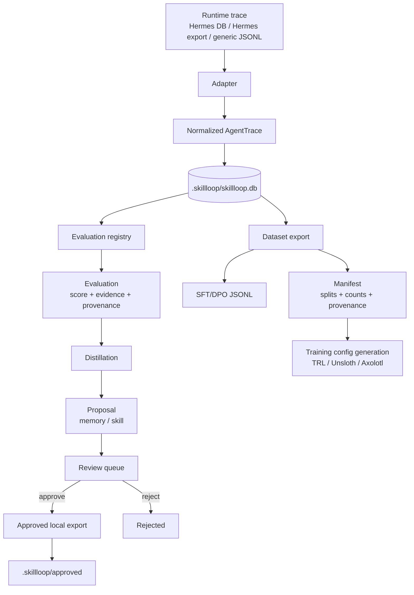
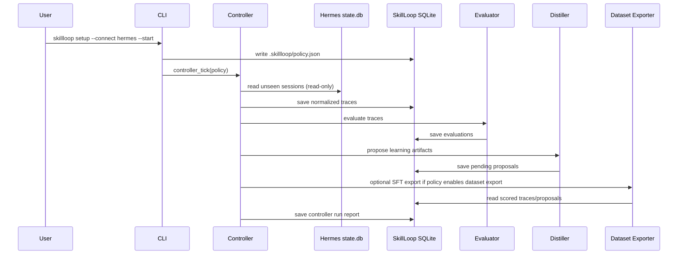

# Architecture

SkillLoop is a local learning governor for agent runtimes.

The runtime executes work. SkillLoop reads completed traces, evaluates them, proposes learning artifacts, and prepares reviewed datasets/configs. It is a sidecar, not a replacement runtime.

Current primary runtime integration: Hermes Agent via read-only `state.db` ingestion.

## Layered architecture

SkillLoop is a layered modular-monolith. Dependencies flow downward only; each layer may import the layer directly below it but not upward. Domain code is pure and never imports infrastructure.

```mermaid
flowchart TB
  subgraph IF["interfaces/ (parsing + presentation only)"]
    CLI["interfaces/cli\n(one module per command group)"]
  end
  subgraph APP["application/ (use-case orchestration)"]
    ING[ingest] EVAL[evaluate] DIS[distill]
    REV[review] EXP[export] CON[controller]
    REQ["requests.py\ntyped request objects"]
  end
  subgraph DOM["domain/ (pure, no I/O)"]
    M[policy.py] C[conditions.py] S[schema.py]
  end
  subgraph PORTS["ports/ (interfaces only)"]
    SM[service_manager.py\nServiceManager ABC]
  end
  subgraph INF["infrastructure/ (adapters)"]
    SQL[sqlite/\nrepository + migrations]
    SVC[services/\nlaunchd + systemd]
    ADP[adapters/\ngeneric_jsonl + hermes]
  end
  CLI --> APP
  APP --> DOM
  APP -.via ports.-> PORTS
  PORTS -.implemented by.-> INF
  APP --> INF
  classDef dom fill:#1b3a4b,stroke:#4ea1d3,color:#fff;
  classDef port fill:#2d3a2e,stroke:#7bbf6a,color:#fff;
  classDef inf fill:#3a2a2a,stroke:#d38a4e,color:#fff;
  class M,C,S dom;
  class SM port;
  class SQL,SVC,ADP inf;
```

Layer rules:

- **Domain** (`policy.py`, `conditions.py`, `schema.py`) must not import `sqlite3`, `argparse`, `launchd`, `subprocess`, or Hermes. It is pure logic and dataclasses.
- **Application** services coordinate use cases but own no infrastructure details. CLI command modules only translate `argparse.Namespace` into typed request objects and render output.
- **Ports** define infrastructure interfaces (`ServiceManager`) with no I/O.
- **Infrastructure** adapters implement the ports: `infrastructure/sqlite/` (repository + versioned migration registry), `infrastructure/services/` (launchd + systemd), and `adapters/` (trace ingestion).
- **CLI** modules contain parsing and presentation only; orchestration lives in `application/`.
- Backward-compatible shims (`store.py`, `cli.py`, `service.py`) re-export the new locations so existing imports keep working until a major release.

## Module layout

| Package | Responsibility |
|---------|---------------|
| `skillloop/interfaces/cli/` | argparse parsing + presentation, one module per command group (init, doctor, setup, status, ingest, evaluate, distill, review, export, dataset, loop, controller, service) + `main.py` dispatcher |
| `skillloop/application/` | use-case orchestration (ingest, evaluate, distill, review, export, controller, loop, benchmark, training, service) + `requests.py` typed request dataclasses |
| `skillloop/ports/` | infrastructure interfaces — `service_manager.py` (`ServiceManager` ABC) |
| `skillloop/infrastructure/sqlite/` | `repository.py` (SQLite I/O, batch ops, pagination, streaming) + `migrations.py` (versioned, atomic, idempotent migration registry) |
| `skillloop/infrastructure/services/` | `launchd.py` (macOS) + `systemd.py` (Linux) implementing `ServiceManager` |
| `skillloop/adapters/` | trace ingestion: `generic_jsonl`, `hermes` |
| `skillloop/diagnostics.py` | `skillloop doctor` read-only health checks |
| `skillloop/errors.py` | error taxonomy: `ConfigError`, `InputError`, `PersistenceError`, `ConnectorError`, `PolicyError` |
| `skillloop/fs_safety.py` | atomic writes, conservative permissions, symlink guards |
| `skillloop/sanitize.py` | secret + PII redaction, sanitized error reports |

## Design goals

- Runtime-agnostic trace ingestion
- Read-only runtime integration
- Stable normalized trace schema
- Local-first persistence
- Deterministic evaluation before LLM-based judging
- Review-before-apply workflow
- Provenance on every durable artifact
- Clean separation from global agent state
- Fine-tuning data/config generation without automatic training
- Conservative defaults that fail closed around credentials and global mutation

## Non-goals for v1

- Replacing Hermes or another agent runtime
- Writing directly into `~/.hermes/memories`, `~/.hermes/skills`, or global config
- Auto-applying proposed memories/skills/prompts
- Running training automatically
- Promoting model candidates automatically
- Storing credentials or hub tokens
- Requiring cloud infrastructure

## System pipeline



## Controller pipeline

The controller is the current autonomous sidecar primitive. A controller tick runs a complete governed pass and records a durable report.



Controller reports are stored in SQLite and mirrored under `.skillloop/controller_runs/*.json`.

## Core modules

### `skillloop.schema`

Defines the normalized dataclasses used across the project:

- `AgentMessage`
- `ToolCall`
- `AgentTrace`
- `Evaluation`
- `Proposal`

Adapters should convert runtime-specific formats into these types as early as possible.

### `skillloop.adapters`

Adapters translate source traces into `AgentTrace`.

Current public adapters:

- `generic_jsonl`: simple JSONL message streams
- `hermes`: Hermes-like JSON exports
- `hermes_state_db`: read-only ingestion from Hermes `state.db`

Adapter requirements:

- preserve source metadata where practical
- redact common secret patterns
- avoid mutating source runtimes
- preserve raw artifact references and hashes where available

### `skillloop.store`

Owns project-local SQLite persistence under:

```text
.skillloop/skillloop.db
```

The store persists:

- traces
- evaluations
- proposals
- controller run reports

The store does not write to global Hermes state or any other runtime state.

### `skillloop.eval`

The current evaluation engine is deterministic. It scores traces based on observable signals such as:

- final answer presence
- errors and tool failures
- success indicators
- user correction signals
- structured evidence records

LLM judges are intentionally deferred until cost tracking and budget policy exist.

### `skillloop.distill`

Distillation creates learning proposals:

- memory proposals for durable facts, preferences, corrections, and conventions
- skill proposals for reusable workflows

Distillation does not directly mutate memory or skills. It writes proposals to the review queue.

### `skillloop.review`

Review helpers list, approve, and reject proposals.

Approval is explicit and prefix-addressable so users can approve generated IDs without copying full UUIDs.

### `skillloop.apply`

The apply step writes approved artifacts into the project-local export area:

```text
.skillloop/approved/memory/*.md
.skillloop/approved/skill/*.md
```

It intentionally does not write into `~/.hermes`.

### `skillloop.export`

Dataset exporters produce JSONL files for later training workflows:

- SFT: `{ "messages": [...] }`
- DPO: `{ "prompt": ..., "chosen": ..., "rejected": ... }`

Exports include dataset manifests with split-level counts, estimated tokens, and provenance summaries.

### `skillloop.benchmark`

Replay benchmarks compare evaluator versions over stored traces. Use this before changing evaluator behavior or before trusting a new scoring strategy for training data gates.

### `skillloop.training_config`

Generates configuration artifacts for TRL, Unsloth, and Axolotl.

This module does not launch training. Generated configs include explicit no-auto-run safety metadata.

### `skillloop.policy` and `skillloop.controller`

`SkillLoopPolicy` stores controller behavior under `.skillloop/policy.json`:

- ingestion settings
- evaluation settings
- dataset export settings
- training safety settings

`controller_tick()` executes the current governed sidecar pass:

```text
ingest -> evaluate -> distill -> optional dataset export -> report
```

Controller-managed dataset export also attaches a report-only readiness verdict
to the dataset action and manifest metadata. This is intentionally not a hard
export gate yet; it is a signal for humans and future training gates.

### `skillloop.loop` and `skillloop.conditions`

The outer-loop primitives support scheduled local evaluation/distillation passes and declarative done conditions:

- score threshold
- required tags
- forbidden tags
- max iterations

These are local scheduling primitives. Platform service installation is handled
behind the `skillloop.ports.ServiceManager` port. Two implementations ship:
`infrastructure/services/launchd.py` (macOS) and `infrastructure/services/systemd.py`
(Linux user-service). Both expose `install`/`status`/`uninstall` with explicit
activation — SkillLoop never silently loads or starts an OS service. The CLI
prints the exact OS command instead. `skillloop.service` is a backward-compatible
facade re-exporting the implementations.

## Deployment Model

SkillLoop is deployed as a local sidecar inside or beside a project, not as a
central cloud service. The practical deployment path is:

```bash
python -m pip install -e .
skillloop --path /path/to/project setup --connect hermes --start --auto-export
```

That command creates project-local `.skillloop/` state, configures read-only
Hermes ingestion, runs one controller tick, and optionally produces a
controller-managed dataset manifest.

This is a one-shot setup/run path. Recurring execution is a separate service
installation step.

For recurring macOS use, the service layer can generate launchd metadata:

```bash
skillloop --path /path/to/project service install --kind launchd --interval-seconds 3600
```

For recurring Linux use, the systemd user-service implementation is shipped:

```bash
skillloop --path /path/to/project service install --kind systemd --interval-seconds 3600
```

SkillLoop does not silently start services. It records metadata and prints the
exact OS command to load or unload the service. Both macOS launchd and Linux
systemd are supported behind the `ServiceManager` port.

The package supports GitHub CLI installs, wheels, editable checkouts, and both
`skillloop` and `python -m skillloop` entry points. `skillloop doctor` verifies
deployment health. SQLite schema changes migrate in place, and indexed bulk
evaluation reads avoid per-trace export queries.

## Boundary with Hermes

Hermes is the runtime. SkillLoop is the learning governor.

SkillLoop may read Hermes sessions, but v1 does not mutate Hermes memories, skills, config, cron jobs, tools, gateway state, or source code.

This boundary is deliberate: it keeps the learning layer inspectable, reviewable, and reversible.

## Roadmap priorities

1. Improve core learning-loop quality: proposal quality, memory/skill distillation, and evidence links.
2. Build a clean demo/deployment path that proves setup, controller run, status/history, readiness, and optional service install in one or two commands.
3. Polish review/apply UX so approved memories and skills are easy to inspect and use.
4. Add a packaged install path and a local deployment wrapper, while keeping OS service loading explicit.
5. Add evaluator staleness detection when evaluator code/provenance changes.
6. Add stronger evidence-trust scoring so learning artifacts depend on tool/user evidence rather than assistant claims.
7. Add approval-gated training plans only after readiness, cost, evaluation, and promotion gates exist.
8. Add evaluator staleness detection when evaluator code/provenance changes.
9. Add stronger evidence-trust scoring so learning artifacts depend on tool/user evidence rather than assistant claims.
10. Add approval-gated training plans only after readiness, cost, evaluation, and promotion gates exist.

The macOS launchd path has passed an isolated real-system smoke test against local Hermes `state.db`: controller tick, status/history/show, dataset manifest generation, service plist generation, service status, and service uninstall all succeeded without loading a persistent OS service.
